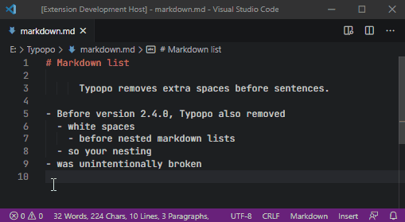
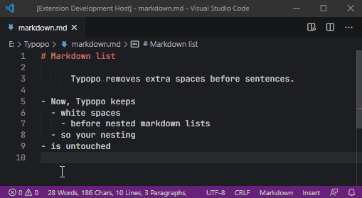

# Changelog for Typopo

## 2.7.0 //

Helper function
- punctuation
 - ~~dash~~ 
 - double-quotes // needs manual refactoring
 - single-quotes // needs manual refactoring
 - ~~ellipsis~~
 - ~~hyphen~~
 - ~~period~~
- symbols
  - ~~copyrights~~
  - ~~exponents~~ 
  - ~~marks~~ 
  - ~~multiplication-sign~~ 
  - ~~number-sign~~
  - ~~numero-sign~~
  - ~~plus-minus~~
  - ~~section-sign~~
- whitespace
  - ~~lines~~
  - nbsp // needs manual refactoring
  - ~~spaces~~ 
- words
  - ~~abbreviations~~ 
  - ~~case~~
  - ~~exceptions~~
  - ~~pub-id~~

theme: split locales, refactor tests to better work with multiple locales, preparation to extend typopo with more detailed configuration

### ✨ New features
- Fix spacing around paragraph sign (¶)
- Fix spacing around numero sign (№)
- Locale-specific spacing after §, ¶, №, ©, ℗

### 💪 Improvements
- Isolate base constants from locale file
- Move locale-specific typography treatments to a locale file
- Extend test cases for integration tests 

### 🐛 Fixes
- Fix false positives when initials were recognized as roman numerals

### 🔨 Maintenance
- Update NPM packages to their latest versions 

## 2.6.0 // 2025-08-09
This release brings significant improvements to the build system and typography handling, along with important bug fixes for percentage formatting across different languages. The modernized build pipeline delivers better performance and smaller bundle sizes while maintaining compatibility across all supported environments.

### ✨ New features
- Fix dash between word and a number, e.g. `Access full ETF holdings—not just the top 10—and explore…`

### 🐛 Fixes
- if there is a space between a digit and a percentage sign (i.e. 15 %), now it will be:
  - removed for `en-us` ([source](https://www.chicagomanualofstyle.org/qanda/data/faq/topics/Numbers/faq0005.html))
  - changed to a narrow non-breaking space for `de-de` ([source](https://german.stackexchange.com/questions/41550/what-does-din-5008-exactly-say-about-percent-character))
  - changed to a non-breaking space for `sk`, `cs`, `rue`

### 💪 Improvements
- Typopo now has separate builds to be used as ES module, CommonJS import, and for direct browser usage. 
- `removeWhitespacesBeforeMarkdownList: false` now also keeps spaces before nested markdown blockquotes 
- CommonJS and UMD distributions were reduced ~25% in bundle size.

### 🔨 Maintenance
- Reorganize the folder structure
- Update NPM packages to their latest versions 
- Refactor the source code
- Remove unused packages
- Update the build pipeline to Vite and Vitest 

## 2.5.8 // 2024-09-22

### 💪 Improvements
- Fix Service Mark, when indicated in brackets, i.e. `Brand(sm)` → `Brand℠`

### 🔨 Maintenance
- Add a build automation
- Automate copyright notice updates in source and dist files
- Refactor code for Registered Trademark (®), Trademark (™), Copyright (©), and Sound Recording Copyright (℗)
- Update dev dependencies to their latest versions
 

## 2.5.7 // 2024-09-11

### 🐛 Fixes
- Fix (#73): the part of the file path was falsely identified as an ordinal number in `sk`, `cs`, `rue`, `de-de` locales
- Fix: Q1 ’23 was falsely changed to Q1’23

### 🔨 Maintenance
- Write additional tests for exceptions: URLs, filenames, and emails
- Change packaging from npm to pnpm
- Update NPM packages to their latest versions

## 2.5.6 // 2023-12-23

### 🐛 Fixes
- Filepaths such as `../../file.ext` or `..\..\file.ext` were falsely chnaged to `././file.ext` or `.\.\file.ext`; with this release, they remain untouched

### 🔨 Maintenance
- Update NPM packages to their latest versions

## 2.5.5 // 2023-08-27

### 💪 Improvements
- Replace a space with a non-breaking space before a single capital letter that is a part of the phrase:
  - `Sputnik V` → `Sputnik⎵V`
  - `The product X has launched.` → `The product⎵X has launched.`

### 🐛 Fixes
- In Markdown, keep the space when e.g. is followed by `code` (e.g. `code`)
- Keep the space when e.g. is followed by emoji (e.g. 🥳)
- Don’t swap the right double quote with ellipsis that follows closing bracket:
  - `Ask “what if (the thing)…”` ⇏ `Ask “what if (the thing)”…`

### 🔨 Maintenance
- Update build scripts
- Update eslint configuration
- Update NPM packages to their latest versions

## 2.5.4 // 2022-07-12

### 💪 Improvements
- Remove spaces before aposiopesis in a quoted sentence, e.g.:
  - `“Sentence ending …”` → `“Sentence ending…”` 
  - `‘Sentence ending …’` → `‘Sentence ending…’`

### 🐛 Fixes
- Update use cases when a space between the number sign (#) and the number is removed. Before, the space was falsely removed between level 2 markdown headings and numbers (e.g. “## 1. introduction” was falsely changed to “##1. introduction”). Now the space is kept. (bug reported by [@filipaldi](https://github.com/filipaldi))
- A dash was not fixed between words, when the first word ended on a letter “ŷ”
- An nbsp was falsely added after a word that had the letter “ŷ” on the second to the last past position, e.g. nbsp was falsely added after the word “starŷm”

### 🔨 Maintenance
- Update NPM packages to their latest versions
- Extra tests and code refactoring for dash.js

## 2.5.3 // 2022-01-16

### 💪 Improvements
- Add or keep space between a multi-word abbreviation (e.g., i.e.) and a quoted word:
  - e.g.“something” → e.g. “something”
- Consolidate spaces around ellipsis that replaces the last item in the list
  - We sell apples, oranges, … → We sell apples, oranges,…
  - (apples, oranges, … ) → (apples, oranges,…)

### 🐛 Fixes
- Fix swapping quotes and terminal punctuation in consecutive quoted sentences. Before the fix, punctuation was changed only in the first quoted sentence.
  - “He was ok”. “He was ok”. → “He was ok.” “He was ok.”

### 🔨 Maintenance
- Update NPM packages to their latest versions

## 2.5.2 // 2021-09-04
No changes in functionality in this release, just repackaging the bundle.

## 2.5.1 // 2021-09-04
No changes in functionality in this release, just updating package dependencies to their latest versions.

## 2.5.0 // 2021-06-08
I’ve done something in this version what I wanted to do for a while. I wanted to refactor modules that fix double quotes and single quotes. These modules were old and difficult to improve. And as I went along refactoring, I’ve also fixed few other issues, so in the end, quite a few things made it into this version.

Since this version (2.5.0), Typopo is tested against 2540 assertion tests (+675 tests since version 2.4.1). The number of tests is not a guarantee there won’t be any bugs, but it indicates a growing desire to cover more and more edge cases.

Here’s a rundown of what’s been new and improved in this version.

### ✨ New features
New configuration option to keep Markdown code blocks in your Markdown files:
- `keepMarkdownCodeBlocks: true` when you want to keep Markdown code blocks in your Markdown files
- `keepMarkdownCodeBlocks: false` want to fix grave accents (`) in generic texts to single quotes 

### ⚡️ Improvements
- Limit identification of “and” contractions to common phrases, and add a non-breaking space around them. Common phrases:
	- dead ’n’ buried
	- drill ’n’ bass
	- drum ’n’ bass
	- rock ’n’ roll
	- pick ’n’ mix
	- fish ’n’ chips
	- salt ’n’ shake
	- mac ’n’ cheese
	- pork ’n’ beans
	- drag ’n’ drop
	- rake ’n’ scrape
	- hook ’n’ kill
- Identify and fix single-quoted ‘words’ outside double quotes
- Swap single quotes and terminal punctuation when single quotes are used only for a portion of a sentence, e.g.:
  - …only a ‘quoted part.’  → …only a ‘quoted part’.
- Keep a space between a number and a number sign (#) at the beginning of the paragraph (e.g. when you’re starting a Markdown headline with a number)
- Limit adding a non-breaking space after cardinal and ordinal numbers with three and more digits.

### 🐛 Fixes
- Fix edge cases around double quotes and double primes:
  - Here are 30 "bucks" → Here are 30 “bucks” *(before, a left quote was falsely identified as a double prime)*
  - "Conference 2020" and "something in quotes". → “Conference 2020” and “something in quotes”. *(before, a right quote after “2020” was falsely identified as a double prime)*
  - "2020" → “2020” *(before, dumb quotes around numbers were not identified as a double quote pair)*
  - He was ok. “He was ok ”. → He was ok. “He was ok.”, *(before, when a right double quote was swapped with a terminal punctuation, the extra space wasn’t removed)*
  -  It’s 12" x 12". → It’s 12″ × 12″. *(before, the second prime was falsely identified as a right double quote)*
  - 12'' → 12″ (two dumb single quotes are fixed to a double prime around numbers)
  - When you ask the “How often…” question *(before, the ellipsis was falsely swapped with a right double quote in this type of Sentence)*
  - It’s a“nice” saying. → It’s a “nice” saying. *(now, the added space is a nbsp, when added before a single-word prepositions)*
- When Typopo is configured as  `removeWhitespacesBeforeMarkdownList : false`, Markdown lists are now kept nested, even when they start with `+`

### 🔨 Maintenance
- Refactor a module to fix double quotes
- Refactor a module to fix single quotes
- Update NPM packages to their latest versions

## 2.4.1 // 2021-03-12
No functional changes in this release.

### Maintenance
* Update NPM packages to their latest versions

## 2.4.0 // 2020-11-25
### New features
New configuration option to remove/keep whitespaces before nested markdown lists.

**Typopo removes nested lists**

`removeWhitespacesBeforeMarkdownList : true`

**Typopo keeps nested lists**

`removeWhitespacesBeforeMarkdownList : false`

### Fixes
* Remove trailing spaces at the end of each line (#45)

## 2.3.7 // 2020-11-01
### Improvements
* Fix acute or grave accents used as apostrophe (Paul´s → Paul’s) (#43)

### Fixes
* Update how aCCIDENTAL case was fixed. When someone types aCCIDENTAL, it’s more likely they held Shift key while the Capslock was on. Therefore the intention was to type “Accidental” (but Typopo was fixing it to “accidental”). (#44)

### Maintenance
* Added [CODE_OF_CONDUCT.md](CODE_OF_CONDUCT.md)
* Update NPM packages to their latest versions

## 2.3.6 // 2020-10-03
### Fixes
* Remove incidents when an extra space was added after en/em dash at the end of a line (#31)
* Remove incidents when an extra space was added before an opening bracket in an optional plural name (e.g. Typopo was falsely fixing name(s) into name (s)) (#36)
* Remove incidents when a non-breaking space was falsely placed before a personal pronoun “I” and removed after it (#38)

### Maintenance
* Revamp [README.md](README.md)
* Refactor functions that fix ®, ™ and ©

## 2.3.5 // 2020-07-27
There are no changes in functionality in this release

### Maintenance
* Update NPM packages to their latest versions

## 2.3.4 // 2020-03-15
### Improvements
* Expand a list of words contracted at the beginning. All these words will now get fixed if the wrong apostrophe is used in front of them: ’cause, ’em, ’mid, ’midst, ’mongst, ’prentice, ’round, ’sblood, ’sdeath, ’sfoot, ’sheart, ’shun, ’slid, ’slife, ’slight, ’snails, ’strewth, ’til, ’tis, ’twas, ’tween, ’twere, ’twill, ’twixt, ’twould

### Fixes
* Remove incidents when a non-breaking space was falsely added after a single-letter word. Before, the script would add an unnecessary nbsp in:
	* “Ctrl+I and…” (i.e. “Ctrl+I⎵and…”),
	* “Ctrl-I and…” (i.e. “Ctrl+I⎵and…”),
	* “Try Ctrl+I” (i.e. “Try⎵Ctrl+I”),
	* “$25M investment” (i.e. “$25M⎵investment”)
* Remove incidents when an ellipsis was accidentally trimmed
	* Before, “Sentence ended. ... and we were there.” was falsely transformed into “Sentence ended… and we were there.” (new behavior: Sentence ended. …and we were there.)
* Remove incidents when commas were accidentally trimmed:
	* Before, “We sell apples, oranges, …, pens.” was falsely transformed into “We sell apples, oranges,… pens.” (new behavior: keep punctuation as is)
* Fix edge cases to match hyphens/dashes between dates
* Fix cases when a space was falsely added into a filename. (e.g. filename.js was falsely transformed into filename .js)

### Maintenance
* Update NPM packages to their latest versions
* Refactor “ellipsis” library to make it more maintainable and extendable.

## 2.3.3 // 2020-01-03
There are no changes in functionality in this release

### Maintenance
* Update NPM packages to their latest versions
* Change how are dist/ built with gulp

## 2.3.2 // 2019-11-02
### Improvements
* Fix multiplication sign for three and more multiplies
	* 5 x 4 x 3 → 5⎵×⎵4⎵×⎵3
	* 5″ x 4″ x 3″→ 5″⎵×⎵4″⎵×⎵3″
	* 5 mm x 5 mm x 5 mm → 5 mm⎵×⎵5 mm⎵×⎵5 mm
* Fix multiplication sign between words
	* š x v x h  → š⎵×⎵v⎵×⎵h (single letters)
	* mm x mm  → mm⎵×⎵mm (abbreviations)
	* Marciano x Clay → Marciano⎵×⎵Clay (words)

### Fixes
* Fixes left single quote identification ([Issue #22](https://github.com/surfinzap/typopo/issues/22))
* Fixes right double quote swapping with a punctuation ([Issue #23](https://github.com/surfinzap/typopo/issues/23))
* Adjust cases when accidental uPPERCASE is fixed
	* two-letter units are no longer falsely corrected (e.g. mA, kW are no longer falsely changed to ma, kw)
	* iOS stays iOS (not ios); btw if you can point to list of common names starting with a single lowercase letter and following with all capital letter, let me know and I’ll update he list of exceptions

## 2.3.1 // 2019-10-25
### Fixes
* Fix the package to run in Node.js projects ([@vit-svoboda](https://github.com/vit-svoboda) in [Issue #19](https://github.com/surfinzap/typopo/issues/19))

## 2.3.0 // 2019-10-19
### New features
* Fix ISSN and ISBN formatting with correct spacing and hyphens
	* ISSN 0000 - 0000 → ISSN⎵0000-0000 (⎵ for non-braking space)
	* issn 0000 - 0000 → ISSN⎵0000-0000
	* ISSN 0000—0000 → ISSN⎵0000-0000
	* ISSN: 0000 - 0000 → ISSN:⎵0000-0000
	* Isbn 80- 902734—1-6 → ISBN 80-902734-1-6
	* Isbn: 978-0-9752298-0-X → ISBN: 0-9752298-0-X
	* 978 - 0 - 9752298 - 0 - 2 → 978-0-9752298-0-2

## 2.2.5 // 2019-10-16
### Improvements
* Fix non-breaking space around a name with regnal number:
	* Karel IV. → Karel⎵IV. (sk, cs, de-de, rue)
	* Karel IV.⎵byl → Karel⎵IV. byl (sk, cs, de-de, rue)
	* Charles IV → Charles⎵IV (en-us)

### Fixes
* Fix accidental swapping of quotes and punctuation that was part of the Roman numeral. Before, the following Sentence: _Byl to “Karel IV.”, ktery neco…_ was erroneously changed into _Byl to “Karel IV”. ktery neco…_.
* Fix when non-breaking space is added around numbers in form of two separate rules:
	* Number follows common abbreviation: On p 3 here you go → On p⎵3 here you go
	* Number precedes a word: I bought 3 oranges → I bought 3⎵oranges
* Fix error when ordinal indicators where incorrectly identified

## 2.2.4 // 2019-10-02
### New features
* Change hyphens into locale-specific dashes between a word and a punctuation (or at the end of the paragraph)
	* (en-us) word -, → word—,
	* (sk, rue) word -. → word —.
	* (cs) word -? → word –?
	* (de) word - → word –

### Fixes
* Minor code refactoring (thanks [krasi0](https://github.com/krasi0) for a code review)

## 2.2.3 // 2019-10-01
### New features
* Remove extra white spaces between a number sign (#) and a number, e.g # 9 → #9
* Remove extra white spaces before ordinal indicators (e.g. 1 st → 1st, 1 . spoj → 1. spoj)

## 2.2.2 // 2019-10-01
### Improvements
* Fix dashes between dates, e.g. 2019 - 08-02 → 2019–08–02 (places ndash)
* Fix dashes between percentage range, e.g. 20% - 30% → 20%–30%
* Replace space with nbsp before % (percent), ‰ (per mille), ‱ (permyriad)

## 2.2.1 // 2019-03-02
### New features
* Replace 2 hyphens with an en dash

### Improvements
* Added popular abbreviations in Rusyn language for fixing spacing
* Extended list of German single-word abbreviations
* Improved identification of double and single primes
* Fixed identification of some edge cases for double quotes

## 2.2.0 // 2019-02-22
### New features
* Support for German language (de-de)
* Fix spacing between multiple-word abbreviations (e.g., hl. m., v. u. Z.) with respect to locale-specific spacing
* Fix spacing before and after single-word abbreviations (10 p. or p. 10) with respect to locale-specific spacing

### Improvements
* Improvements in identification of wrong use of ellipsis and aposiopesis
* Improvements in identification of wrong use of single quotes
* Improvements in identification of name initials, e.g. J. Hus, F.X. Šalda or Ch.G.D. Lambert. Also, previous portion of the script was catching many false positives, which was reduced with this update.
* Make en dash the default dash for Czech language

## 2.1.9 // 2018-11-11
### Improvements
* Change Narrow NBSP into Hair space from the left side of the m-dash in sk, cs, rue locale
* Add space around ellipsis between two words (word...word → word… word)

## 2.1.8 // 2017-07-15
### Improvements
* Narrow down cases when accidental uppercase was identified to avoid false correction of special brand names (e.g. BigONE) or capitalized plurals (e.g. two Panzer IVs, seven MPs)

### Fixes
* Fix false identification of a.m., p.m. (e.g. 10 Americans were falsely fixed to 10 a.m.ericans)
* Do not space abbreviations (e.g. the U.S. were falsely fixed to the U. S.)

## 2.1.7 // 2017-07-12
### Fixes
* Fix abbreviations (e.g., i.e., a.m., p.m.), when they're followed by a bracket (bracket got accidentally trimmed)
* Fix abbreviations (e.g., i.e.), when they're followed by a number (number got accidentally trimmed)
* Fix cases when periods where removed from the list of abbreviations

## 2.1.5 // 2017-05-31
### Fixes
* Fix abbreviations (e.g., i.e.), when they're used in the brackets

## 2.1.4 // 2017-04-23
### Fixes
* fix Nbsp module (it was falsely changing 10.00 → 10. 00)

## 2.1.3 // 2017-04-07
### Improvements
* Fix abbreviations (e.g., i.e., a.m., p.m.), even when there are multiple spaces between them (e.    g. → e.g.)
* Change double quotes to apostrophes in contracted words (don"t → don’t)
* Add non-breaking space after ordinal number in sk, cs, rue (1.dodatok → 1. dodatok)
* Add non-breaking space after roman numeral in sk, cs, rue (I.dodatok → I. dodatok)

### Fixes
* Fix Abbreviation module (it was falsely removing spaces at the beginning of the abbreviation)

### Refactoring
* Module for correcting Trademark symbol (™)
* Module for correcting Registered Trademark symbol (®)
* Module for correcting Plus-minus symbol (±)

## 2.1.2 // 2017-03-26
### Improvements
* Combination of ellipses and dots is corrected to a single ellipsis (e.g. Sentence ending.…..... → Sentence ending…)
* Module for removing extra spaces before pause punctuation (ie. ,:;) now does not remove spaces before that punctuation if it's part of smiley :).

### Fixes
* Fix Abbreviations module (removing false identification: či e-mail marketing → čie -mail marketing)
* Fix Case module (CMSko → CMSko, instead of CMsko)

## 2.1.1 // 2017-03-04
### New features
* Em dash is now corrected with no spaces around it in English language, and with narrow non-breaking space and hair space around it in Rusyn, Czech and Slovak language
* Multiplication sign improvements
	* 4 x followed by a word → 4 × followed by a word
	* 4x followed by a word → 4× followed by a word
	* inches and feet multiplication (e.g. 12" x 12" → 12″ × 12″ )

### Fixes
* Fix how ellipsis was corrected
* Fix falsely added non-breaking space after abbreviated word (e.g. client’s customer)
* Fix exponent use-case like Holmen 80 g/m²

## 2.1.0 // 2017-02-19
### New features
* Fixes spacing around section sign (§), copyright (©), sound recording copyright (℗)
* Fixes non-breaking spaces after abbreviations (these are supported now: č., s., fol., str., r., par., odst., např., napr., sv., tj., tzv., čl., hl., m., e.g., i.e., p., pp.)
* Fixes square and cube exponents (e.g. 100 µm² → 100 µm², 50 km³ → 50 km³)
* Improvements to how double quotes and single quotes are identified
* Fixes extra space around dash (i.e. e -shop → e-shop, e- shop → e-shop)

## 2.0.0 // 2017-02-13
### Feature updates
* Replaces (p), (P) → ℗
* Improvements to how single quotes are identified
* Improvements to spacing around double quotes
* Adds non-breaking spaces after ordinal numbers
* Adds non-breaking spaces after ordinal Roman numerals
* Adds non-breaking spaces after name initials (i.e. Philip K. Dick)
* Fix: Remove multiple spaces, even they are non-breaking spaces, hair spaces or narrow non-breaking space
* Fix: Abbreviations were (a.m., p.m.) were generating extra space at the end of the Sentence or string

### Code updates
Complete codebase refactoring
* Typopo is now broken down into separate modules to increase maintainability and testability
* Tests are running automatically via Mocha
* Locale-specific attributes are now in separate locale files
* Breaking change: call fixTypos() instead of correct_typos(); see README for more details
* variables have been transformed into camelCase

## 1.4.0 // 2017-01-15
* “Removing empty lines” is now an optional parameter (in case you want to correct your plain-text based content or an email). By default, empty lines are removed
* Dropped support for correcting capital letter at the beginning of the Sentence. It yielded too much false positives. Feature may be re-introduced later in the future

## 1.3.1 // 2017-01-08
* (hotfix) exclude false identification of i.e., e.g., a.m., p.m.

## 1.3.0 // 2017-01-08
* identify and correct a.m., p.m.
* replace hyphen or dash, placed between 2 ordinal numbers with an en dash
* replace hyphen or dash, placed between 2 cardinal numbers with an en dash
* remove cases when single right quote is swapped with a punctuation
* improve cases when double right quote is swapped with a punctuation

## 1.2.1 // 2017-01-05
* refactor sentence punctuation references
* refactor variable references

## 1.2.0 // 2017-01-01
* improve removing of extra spaces around punctuation and at the end of the sentences, by including non-breaking spaces, hair spaces and narrow spaces
* improve spacing correction around ellipsis and aposiopesis
* fix undesired correction of web URLs and email addresses

## 1.1.0 // 2016-12-24
* Refactor how double and single quotes, primes and apostrophes are handled, whic results in following improvements
  * add more use-cases for identifying double/single primes and apostrophes
  * fix accidental swapping of single quotes in Rusyn language with a punctuation
  * fix space after arc

## 2016-12-04
* 1.0.6
* fix replacement of i.e., e.g.
* fix inconsistent variables

## 2016-12-04
* 1.0.5
* New stuff
  * correct spelling of e.g. and i.e.
  * add narrow non-breaking spaces and hair spaces around em dash
  * remove extra punctuation, e.g. “Hey!,” she said. → “Hey!” she said.
* Code update
  * increase code readability by translating different spaces into variables

## 2016-08-29
  * 1.0.4
  * consolidate placement of non-breaking spaces for multi-character words and numerals
  * consolidate dash replacement (replace -- with – and --- with —)
  * remove trailing spaces

## 2016-08-24
 * 1.0.3
 * add support for Rusyn double quotes «, » and single quoutes ‹, ›
 * fixes
	 * insert non-breaking space before other cyrillic single characters (ї, є, Ї, Є)

## 2016-07-10
 * 1.0.2
 * Fixes
		 * add cyrillic [х, Х] to regex character set

## 2016-04-10
 * 1.0.1
 * New stuff
		 * replace space with non-breaking space after one-word prepositions in Rusyn
		 * fix false positives for sentence case on ordinal numbers in Slovak, Czech and Rusyn language
		 * replace capital letter at the beginning of the paragraph
		 * add space after punctuation where it’s missing
		 * remove space before aposiopesis, that is ending a sentence
		 * space ellipsis correctly, when used around commas
		 * remove spaces when ellipsis is used in brackets
		 * remove space when aposiopesis is used at the beginning of the Sentence
 * Stuff that went away
		* remove spaces around slashes that are used in dramatic texts (since slashes can be used in various contexts and current implementation was not able to detect them all)

## 2016-03-28
 * 1.0.0
 * correct single quotes and apostrophes
		* single quotes and apostrophes can be mixed and matched in various ways and it’s a bigger task to identify all of incorrectly used single quotes/apostrophes. However, we have thought about different means of how we could identify and correct the most common cases. We're now able to correct them with following assumptions:
				* Double quotes are used in pairs
				* Single quotes are used in pairs
				* Single quotes are used as secondary (ie. within double quotes, which is a convention for currently supported languages — en, sk, cs, rue — [check wiki](https://en.wikipedia.org/wiki/Quotation_mark#Summary_table_for_various_languages))
				* Single quotes are used with proper spacing (ie. a space before Left single quotation mark and a space after Right single quotation mark)
 * [Breaking change] refactor clean_typos() to fixTypos()

## 2016-03-20
 * 0.0.11
 * replace space with non-breaking space after one-word prepositions and "&"

## 2016-03-13
 * 0.0.10
 * correct accidental uPerRCase
 * make typopo as an NPM package (thanks to Matus Duchon)

## 2016-02-20
 * 0.0.9
 * replace (tm) and (TM) with ™
 * replace +- and -+ with ±

## 2016-01-30
 * 0.08
 * remove space arround slashes that are used in dramatic texts
 * start sentence with a Capital letter
 * correct dash for hyphen when it is used for joining words

## 2015-11-22
 * 0.07
 * Typopo now corrects common typos in English language as well
 * temporary removal of support for the correction of single quotes (in exchange for English support)
 * corrects the apostrophes
 * removes extra spaces between a word and ;
 * minified version added  

## 2015-11-04
 * 0.06
 * support for correction of two consequenting single quotes ''
 * swap quotes for punctuation .,?!

## 2015-11-03
 * 0.05
 * removes too many new lines between paragraphs
 * removes spaces before additional punctuation [,:]
 * updates for
 * additional use cases to corrects „Slovak, Rusyn, Czech double quotation marks“

## 2015-11-02
 * 0.04
 * corrects „Slovak, Rusyn, Czech double quotation marks“
 * corrects ‚Slovak, Rusyn, Czech single quotation marks‘
 * removes extra spaces along ‚Slovak, Rusyn, Czech single quotation marks‘
 * sets up correct typography for multiplication sign
 * replaces hyphen or en dash with em dash

## 2015-11-01
 * 0.03
 * removes extra spaces between „Slovak, Rusyn, Czech double quotation marks“
 * removes extra spaces between parentheses ()
 * removes extra spaces & tabs at the beginning of the paragraph

## 2015-10-20
 * 0.02
 * transforms 2 and more periods with ellipsis
 * removes multiple spaces between the words
 * removes spaces before punctuation [.!?]
 * rewrites:
		* "(C)" : "©"
		* "(c)" : "©"
		* "(R)" : "®"
		* "(r)" : "®"

## 2015-10-19
 * 0.01 initial repo
 * initial tests written