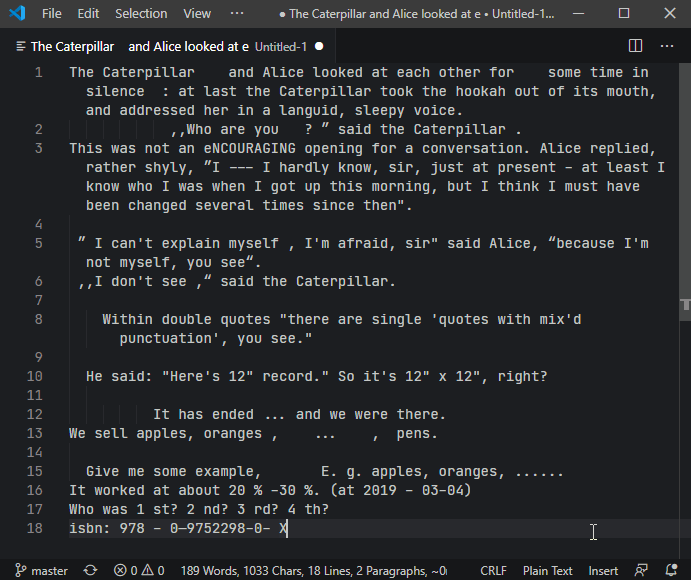

> Fix frequent microtypography errors in multiple languages. Write neat texts without bothering about typography rules. Typopo works for English, German, Slovak, Czech and Rusyn language.


## Links
- [Official website](https://typopo.org)
- [Online app](https://typopo.org)
- [VS Code extension](https://marketplace.visualstudio.com/items?itemName=brano.typopo-vscode) and corresponding [repository](https://github.com/surfinzap/typopo-vscode)
- [NPM package](https://www.npmjs.com/package/typopo)
- [Support the project at Patreon](https://www.patreon.com/branosandala)
- [Subscribe to a newsletter to get updates](https://buttondown.email/Typopo)
- [Follow on twitter](https://twitter.com/typopo_app)

## Contents
- [Links](#links)
- [Contents](#contents)
- [Features](#features)
- [Use](#use)
	- [Online app](#online-app)
	- [VS Code extension](#vs-code-extension)
	- [NPM package](#npm-package)
	- [JavaScript library](#javascript-library)
	- [API](#api)
- [News & Releases](#news-releases)
- [Support](#support)
- [Feedback](#feedback)
- [License](#license)
- [Special thanks](#special-thanks)

## Features
Fixes punctuation:
* double quotes (and accidentally-typed punctuation related to the use of double quotes)
* double primes
* single quotes (with assumption they are used as [secondary](https://en.wikipedia.org/wiki/Quotation_mark#Summary_table_for_various_languages) and in pairs)
* single primes
* apostrophes
* hyphens & dashes
	* between words with a proper spacing per locale
	* between ordinal and cardinal numbers
	* within date
	* between percentage range
* period & ellipsis

Fixes whitespace characters:
* removes extra white spaces
	* at the beginning and the end of sentences (leading and trailing spaces)
	* between words and paragraphs
	* before or after a punctuation
	* around an ellipsis and an aposiopesis (where applicable)
	* between a number sign (#) and a number
	* before ordinal indicators (e.g. 1 st → 1st)
* removes empty lines
* fixes non-breaking spaces
	* removes nbsp between multi-letter words
	* adds nbsp
		* after one-word prepositions
		* around “×”
		* after “&”
		* after cardinal numbers
		* after ordinal numbers
		* ordinal Roman numerals
		* after name initials (i.e. Philip K. Dick)
		* after common single-word and multiple-word abbreviations
	* replaces space with nbsp before % (percent), ‰ (per mille), ‱ (permyriad)

Fixes words:
* accidental uPPERCASE
* spelling of e.g., i.e., a.m. and p.m.
* ISSN and ISBN formatting

Fixes symbols:
* multiplication sign (×)
* section sign (§)
* copyright (©)
* sound recording copyright (℗)
* registered trademark (®)
* trademark (™)
* plus-minus sign (+-, -+ → ±)
* square and cube exponents (e.g. 100 µm² → 100 µm², 50 km³ → 50 km³)

## Use

You can use Typopo as an [online app](#online-app), [VS Code extension](#vs-code-extension), [NPM package](#npm-package) or [JavaScript library](#javascript-library).


### Online app
URL → [https://typopo.org/](https://typopo.org/)

The online app is useful especially when you’re a book designer or a DTP operator. Before you typeset raw texts in a DTP app of your choice, run it through Typopo and fix microtypography with a single click.


### VS Code extension



### NPM package
Include Typopo as an NPM package in your web project:

```
npm install typopo
```

Check out an [API](#api) on how to use the package.

### JavaScript library
Download dist/typopo.min.js and include it in your web project or CMS. Check out an [API](#api) on how to use the package.


### API

fix typos in given text and locale:
```javascript
fixTypos(string, locale)
```

supported languages:
* "en-us" (English, default)
* "rue" (Rusyn)
* "sk" (Slovak)
* "cs" (Czech)
* "de-de" (German)

optional configuration:
```javascript
fixTypos(string, locale, configuration)
```

example of configuration:
```javascript
configuration = {
	removeLines : true,
}
```
(“removeLines” is the only available configuration option for now)


## News & Releases
Check out the [changelog](CHANGELOG.md) for what’s has been released.

[Subscribe to Typopo Newsletter](https://buttondown.email/Typopo) to be the first to know about all the new features and improvements.


## Support
If you love Typopo and you find it helpful, [support the project via Patreon](https://www.patreon.com/branosandala).

Your support will let me continue improving Typopo ecosystem—[the app](https://typopo.org), [NPM package](https://www.npmjs.com/package/typopo) and [VS Code Extension](https://marketplace.visualstudio.com/items?itemName=brano.typopo-vscode).


## Feedback
Have you found a bug? Do you have an idea for a feature request? You’re more then welcome to [submit an issue here on GitHub](https://github.com/surfinzap/typopo/issues/new/choose).

If you prefer to reach out me via email, feel free to drop me a line at <help@typopo.org>.


## License
Licensed under MIT license. (See [LICENCE.TXT](//github.com/surfinzap/typopo/blob/master/LICENSE.txt).)


## Special thanks
- [@Viclick](https://github.com/vilemj-Viclick) for adjusting the repo for modularisation (2.0.0)
- [@tomashruby](https://github.com/tomashruby) for consultation on architecture (2.0.0)
- [@skurzinz](https://github.com/skurzinz) for consultation & test on German typographic rules (2.2.0)
- Filip Blažek for consultation on typography rules
- [@vit-svoboda](https://github.com/vit-svoboda) for fixing the package to run in Node.js projects (2.3.1)
