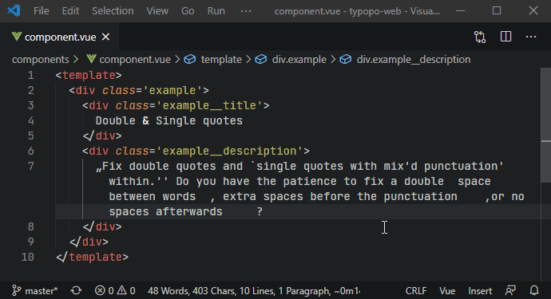

> Fix frequent microtypography errors in multiple languages. Write neat texts without bothering about typography rules. Typopo works for English, German, Slovak, Czech and Rusyn language.


## Links
- [Official website](https://typopo.org)
- [Online app](https://typopo.org/app)
- [VS Code extension](https://marketplace.visualstudio.com/items?itemName=brano.typopo-vscode) and the corresponding [repository](https://github.com/surfinzap/typopo-vscode)
- [NPM package](https://www.npmjs.com/package/typopo)
- [Support the project, buy me a coffee](https://ko-fi.com/branosandala)
- [Subscribe to a newsletter to get updates](https://buttondown.email/Typopo)
- [Follow on twitter](https://twitter.com/typopo_app)

## Contents
- [Links](#links)
- [Contents](#contents)
- [Features](#features)
- [Use](#use)
	- [Online app](#online-app)
	- [VS Code extension](#vs-code-extension)
	- [Installation](#installation)
		- [ES Module (Recommended)](#es-module-recommended)
		- [CommonJS](#commonjs)
		- [Browser/UMD](#browserumd)
	- [API](#api)
- [News \& Releases](#news-releases)
- [Support](#support)
- [Feedback](#feedback)
- [License](#license)
- [Special thanks](#special-thanks)

## Features
Typopo fixes microtypography hiccups in five languages:
- English
- German
- Czech
- Slovak
- Rusyn

Typopo fixes punctuation:
- double quotes (and accidentally typed punctuation related to the use of double quotes)
- double primes
- single quotes (with an assumption they are used as [secondary](https://en.wikipedia.org/wiki/Quotation_mark#Summary_table_for_various_languages) and in pairs)
- single primes
- apostrophes
- hyphens & dashes
	- between words with a proper spacing per locale 
	- between ordinal and cardinal numbers (e.g. 1–3 eggs)
	- within date (e.g. 2020–08–04)
	- between percentage range (e.g. 20–30 %)
- period & ellipsis

Typopo fixes whitespace characters:
- removes extra white spaces
	- at the beginning and the end of sentences (leading and trailing spaces)
	- between words and paragraphs
	- before or after punctuation (where applicable)
	- around an ellipsis and an aposiopesis (where applicable)
	- between a number sign (#) and a number
	- before ordinal indicators (e.g. 1 st → 1st)
- removes empty lines
- fixes non-breaking spaces
	- removes a nbsp between multi-letter words
	- replaces a space with a nbsp
		- after one-word prepositions
		- around “×”
		- after “&”
		- after cardinal numbers
		- after ordinal numbers
		- after ordinal Roman numerals
		- before single capital letters that are part of the phrase (e.g. Project X)
		- after name initials (e.g. Philip K. Dick)
		- after common single-word and multiple-word abbreviations
		- before % (percent), ‰ (per mille), ‱ (per myriad)

Typopo fixes words:
- accidental uPPERCASE
- the spelling of e.g., i.e., a.m. and p.m.
- ISSN and ISBN formatting

Typopo fixes symbols:
- multiplication sign (2 x 3 → 2 × 3)
- section sign (§), paragraph sign (¶)
- copyright ((c)2020 → © 2020)
- sound recording copyright ((p)2020 → ℗ 2020)
- registered trademark (Brand(r) → Brand®)
- service mark (Brand(sm) → Brand℠)
- trademark (Brand(tm) → Brand™)
- plus-minus sign (+-, -+ → ±)
- square and cube exponents (e.g. 100 µm² → 100 µm², 50 km³ → 50 km³)

## Use

You can use Typopo as an [online app](#online-app), [VS Code extension](#vs-code-extension), or [NPM package](#npm-package).


### Online app
URL → [https://typopo.org/](https://typopo.org/)

The online app is useful especially when you’re a book designer or a DTP operator. Before you typeset raw texts in a DTP app of your choice, run it through Typopo and fix microtypography with a single click.


### VS Code extension



### Installation

#### ES Module (Recommended)
For modern Node.js and bundler environments:
```bash
npm install typopo
```
```javascript
import { fixTypos } from 'typopo';
```

#### CommonJS
For legacy Node.js environments or when require() is needed:
```javascript
const { fixTypos } = require('typopo');
```

#### Browser/UMD
For direct browser usage without a bundler:
```html
<script src="https://unpkg.com/typopo/dist/typopo.umd.js"></script>
<script>
  const correctedText = typopo.fixTypos('Your text here');
</script>
```

Check out the [API](#api) section for usage details.


### API
Fix typos in given text (string) and locale; with an optional configuration:
```javascript
fixTypos(string, locale, [configuration])
```

Locale options (supported languages):
- "en-us" (English, default)
- "rue" (Rusyn)
- "sk" (Slovak)
- "cs" (Czech)
- "de-de" (German)

Optional configuration as a JavaScript object:
```javascript
configuration = {
	// If true, removes empty lines between paragraphs
	removeLines : true, 
  
	// if true, removes empty spaces before a nested Markdown list or blockquote; 
	// set as false when you use Typopo to fix typography of your Markdown files and you want to keep the nesting
	removeWhitespacesBeforeMarkdownList : true, 

	// if true, markdown code blocks (i.e. `code`, ``code``, ```code```) will be ignored from being identified as incorrectly used single quote or double quote pairs
	// set as false when you want to fix typos in generic texts (non-Markdown files)
	// set as true when you want to keep Markdown code blocks in your Markdown files
	keepMarkdownCodeBlocks: false,
}
```


## News & Releases
Check out the [changelog](CHANGELOG.md) for what has been released.

[Subscribe to Typopo Newsletter](https://buttondown.email/Typopo) to be the first to know about all the new features and improvements.


## Support
If you love Typopo and you find it helpful, [buy me a coffee](https://ko-fi.com/branosandala).

Your support will let me continue improving Typopo ecosystem—[the app](https://typopo.org), [NPM package](https://www.npmjs.com/package/typopo) and [VS Code Extension](https://marketplace.visualstudio.com/items?itemName=brano.typopo-vscode).


## Feedback
Have you found a bug? Do you have an idea for a feature request? You’re more than welcome to [submit an issue here on GitHub](https://github.com/surfinzap/typopo/issues/new/choose).

If you prefer to email, drop me a line at <help@typopo.org>.


## License
Licensed under MIT license. (See [LICENCE.TXT](//github.com/surfinzap/typopo/blob/master/LICENSE.txt).)


## Special thanks
- [@Viclick](https://github.com/vilemj-Viclick) for adjusting the repo for modularisation (2.0.0)
- [@tomashruby](https://github.com/tomashruby) for consultation on architecture (2.0.0)
- [@skurzinz](https://github.com/skurzinz) for consultation & test on German typographic rules (2.2.0)
- Filip Blažek for consultation on typography rules
- [@vit-svoboda](https://github.com/vit-svoboda) for fixing the package to run in Node.js projects (2.3.1)
